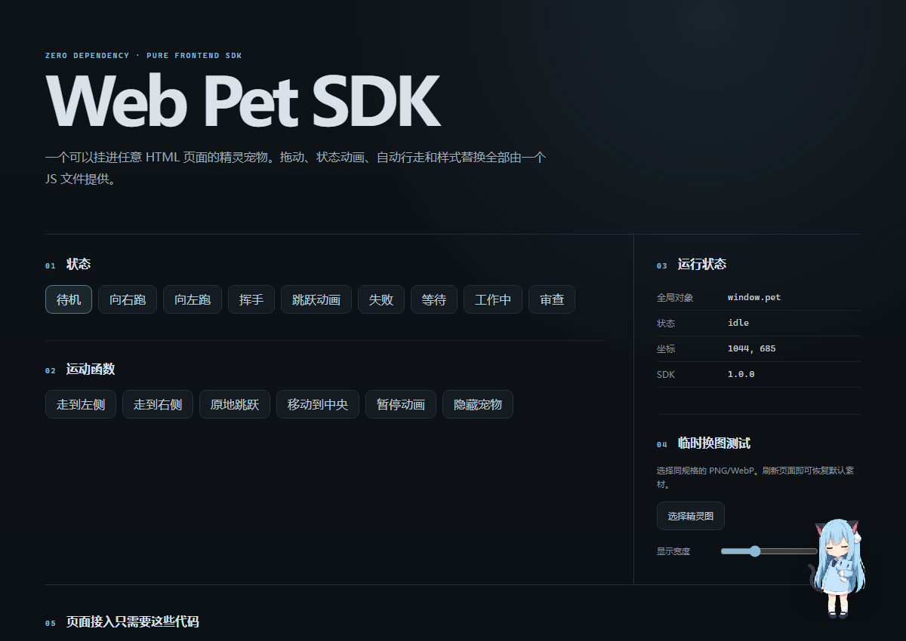

# Codex Web Pet SDK 

[中文](#中文) | [English](#english)

---

## 中文

一个无外部依赖、纯前端开发的 Codex 网页精灵宠物 SDK。你完全可以复用 Codex Pets 的宠物生态来丰富网页悬浮窗的主题，比如 [petdex](https://petdex.dev/)。

不需要 Node.js、npm、React 或复杂的构建工具。只需将 `web-pet.js` 和精灵图放进网页目录，引入一个 `<script>` 标签即可让可动的桌面宠物入驻你的网页，支持拖拽、动作动画、自动行走与自定义换肤。

项目默认集成了开源桌面宠物 **猫羽雫 (Shizuku)** 的动画精灵图。

### 项目预览



### 文件结构

```text
codex-pet-web/
├── index.html                         演示测试页面
├── demo.css                          演示页面样式（非 SDK 必需文件）
├── demo.js                           演示页面绑定与状态同步逻辑
├── web-pet.js                        SDK 主核心文件
├── README.md                         中英双语说明文档
└── assets/
    ├── codex-spritesheet.webp        猫羽雫 (Shizuku) 精灵雪碧图
    └── preview.png                   项目运行截图
```

真正接入其他网页时，只需提取以下文件：
* `web-pet.js`
* 你的精灵图（如 `assets/codex-spritesheet.webp`）

### 最小接入示例

将以下代码置于页面 `</body>` 标签前即可：

```html
<script src="./web-pet.js"></script>
<script>
  // 创建并自动挂载宠物
  const pet = WebPet.create({
    spriteSheet: "./assets/codex-spritesheet.webp"
  });
  
  // 便于全局调试
  window.pet = pet;
</script>
```

---

### SDK 配置参数表

创建时可以通过传入对象进行定制：

```js
const pet = WebPet.create({
  // 精灵图资源地址
  spriteSheet: "./assets/codex-spritesheet.webp",

  // 精灵图规格配置 (8列 x 11行)
  columns: 8,
  rows: 11,
  cellWidth: 192,
  cellHeight: 208,

  // 网页中的视觉呈现尺寸 (高度不传则自动按比例缩放)
  width: 128,
  height: null,

  // 初始动画状态
  initialState: "idle",

  // 位置配置 (支持 left/top/right/bottom)
  position: {
    right: 28,
    bottom: 26
  },

  // 是否允许在页面内鼠标拖拽
  draggable: true,
  
  // 是否限制不拖出浏览器可视区域
  keepInViewport: true,

  // 是否将拖拽的位置持久化保存到 localStorage
  persistPosition: true,
  persistenceKey: "web-pet-position",

  // 点击宠物时的动作："toggle-playback"（暂停/继续）或 "none"
  clickAction: "toggle-playback",

  // 网页内图层层级 (zIndex)
  zIndex: 2147483000,

  // 像素艺术渲染策略：pixelated (像素) / auto (平滑)
  imageRendering: "pixelated",

  // 投影效果
  shadow: "drop-shadow(0 14px 14px rgba(0, 0, 0, 0.28))"
});
```

### 动作控制与运动 API

```js
// 1. 改变动作状态
pet.state = "waving"; // 或者 pet.setState("waving");

// 2. 播放控制
pet.play();
pet.pause();
pet.toggle();

// 3. 原地跳跃
await pet.motion.jump({
  height: 72,
  duration: 650
});

// 4. 走向指定坐标 (会自动根据坐标在左/右侧切换 running-left / running-right 动画)
await pet.motion.walkTo(600, 400, {
  duration: 1200
});

// 5. 隐藏/显示/销毁
pet.hide();
pet.show();
pet.destroy();
```

---

## English

A dependency-free, pure-frontend Codex Web Sprite Pet SDK. You can fully reuse the Codex Pets ecosystem to enrich the themes of your web floating widget, such as [petdex](https://petdex.dev/).

No Node.js, npm, React, or complex bundling tools are required. Put `web-pet.js` and the spritesheet into your web folder, include a single `<script>` tag, and render an interactive floating pet on your webpage. Supports dragging, animations, auto-pathing, and skin hot-swaps.

By default, this repository features the open-source pet **Shizuku (猫羽雫)** animations via WebP spritesheet.

### Project Preview


### Repository Structure

```text
codex-pet-web/
├── index.html                         Interactive demo page
├── demo.css                          Styles for demo (not required for SDK)
├── demo.js                           Binding and sync logic for demo
├── web-pet.js                        Core SDK source file
├── README.md                         Bilingual documentation
└── assets/
    ├── codex-spritesheet.webp        Shizuku (猫羽雫) animation atlas
    └── preview.png                   Captured demo screenshot
```

To integrate this SDK into your own web projects, you only need:
* `web-pet.js`
* The spritesheet file (e.g. `assets/codex-spritesheet.webp`)

### Minimum Integration Example

Add this snippet right before the closing `</body>` tag on your HTML page:

```html
<script src="./web-pet.js"></script>
<script>
  // Instantiate and mount the pet widget
  const pet = WebPet.create({
    spriteSheet: "./assets/codex-spritesheet.webp"
  });

  // Expose to window for testing
  window.pet = pet;
</script>
```

---

### Configuration Options Reference

Customize your pet by passing parameters to the initialization constructor:

```js
const pet = WebPet.create({
  // URL to the spritesheet image
  spriteSheet: "./assets/codex-spritesheet.webp",

  // Sheet grid details (8 columns x 11 rows by default)
  columns: 8,
  rows: 11,
  cellWidth: 192,
  cellHeight: 208,

  // Render dimensions on screen (height auto-calculates if omitted)
  width: 128,
  height: null,

  // Initial animation action loop
  initialState: "idle",

  // Initial positioning anchor (supports top/bottom/left/right)
  position: {
    right: 28,
    bottom: 26
  },

  // Enable dragging on page
  draggable: true,
  
  // Constrain the pet from being dragged outside the viewport
  keepInViewport: true,

  // Keep location persistent in localStorage across refreshes
  persistPosition: true,
  persistenceKey: "web-pet-position",

  // Callback on click: "toggle-playback" or "none"
  clickAction: "toggle-playback",

  // Style z-index layering
  zIndex: 2147483000,

  // CSS Image rendering styling: 'pixelated' or 'auto'
  imageRendering: "pixelated",

  // CSS filter styling for drop shadows
  shadow: "drop-shadow(0 14px 14px rgba(0, 0, 0, 0.28))"
});
```

### Motion and Interaction APIs

```js
// 1. Swap actions
pet.state = "waving"; // or pet.setState("waving");

// 2. Transport control
pet.play();
pet.pause();
pet.toggle();

// 3. Perform a jump in place
await pet.motion.jump({
  height: 72,
  duration: 650
});

// 4. Walk to coordinates (switches run animations depending on direction target)
await pet.motion.walkTo(600, 400, {
  duration: 1200
});

// 5. Hide, show or release resources
pet.hide();
pet.show();
pet.destroy();
```

---

## License

- The codebase is licensed under the [MIT License](LICENSE).
- The Shizuku pet assets are created by the repository owner and distributed under open-source specifications.
